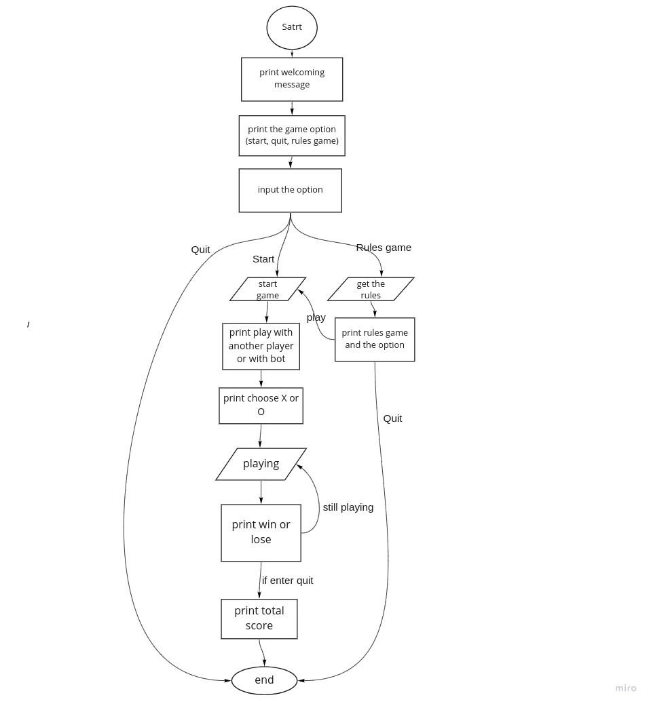
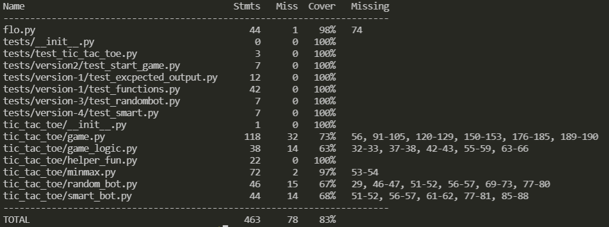

# Tic-Tac-Toe

## Gitting started :

1. Go to [game.py](tic_tac_toe/game.py)
2. Run `python tic_tac_toe/game.py`

## Summary of Project:

Tic-tac-toe the childhood game, it is a simple game that requires two players who take turns marking the spaces in a three-by-three grid with X or O. The player who succeeds in placing three of their marks in a horizontal, vertical, or diagonal row is the winner.

## What problem or pain point does it solve?:

Since the game requires two players, our game will provide the ability only for one human player, and the computer will be the second player.

## What is the minimum required for you to present on your demo day?

1. The user should be play the game with the bot and we have two choices: command line or with GUI
2. The user should be able to choose X or O
3. Each user should be able to see his total score through his choice for X or O
4. The user will be able to play the game with other user or with the bot

## Team Memeber:

1. Adham Mhadyat

2. Faisal Kushha

3. Ashrf Obeidat

4. Aseel Al-Saqer

## User Stories:

[User-Stories](https://trello.com/b/pwxCc7hv/tic-tac-toe)

## Software Requirements:

[Software-Requirements](Software-Requirements.md)

## Domain Modeling:

## Project Agreement:

[Project-Agreement](Project-Agreement.md)

## Tools:

- python = "^3.8"
- coverage = "^6.1.1"
- colorama = "^0.4.4"
- termcolor = "^1.1.0"
- pytest-cov = "^3.0.0"

## Running test :

- test_rules :  
  Tests displaying the rules .
- test_second :  
  Tests if two human players are playing .
- test_win_horezental:  
  Tests the function which detrmine if the player won horezentally.
- test_win_virtical:  
  Tests the function which detrmine if the player won virtically.
- test_win_diagonal:  
  Tests the function which detrmine if the player won diagonally.
- test_loser:  
  Tests the player lose
- test_check_draw:  
  Tests the function check-draw.
- test_minimax:  
  Tests for the best move of the smart bot.
- test_the_first:  
  Tests who will start the game .
- test_smart:  
  Tests for the smart bot functionalty.

## Test Coverage

